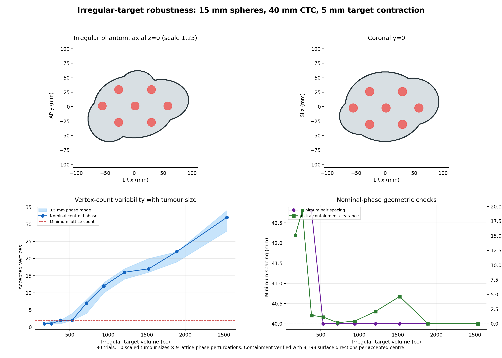

# Irregular-volume robustness study

## Question

How does the 15 mm vertex / 40 mm centre-to-centre lattice behave as a connected, lobulated target changes size, and how sensitive is the count to small changes in lattice phase?

## Method

The phantom is the union of four overlapping ellipsoids, producing a connected asymmetric volume with lobes and concave joins. One base geometry was uniformly scaled to ten target volumes from 170 to 2538 cc (equivalent spherical diameters 68.8 to 169.2 mm). The same `Geometry.Plan` implementation compiled from `src/LatticeSphereGenerator.cs` generated every lattice.

Each size was run at the calculated phantom centroid and with eight ±5 mm origin perturbations: positive/negative LR, AP and SI, plus positive/negative combined shifts. These perturbations stress lattice-phase sensitivity; the normal script uses the mesh centroid and does not randomly perturb it. End-slice filling and slice retry remained enabled. Image planes were modelled at 2 mm spacing.

Complete-sphere containment plus the 5 mm target contraction was modelled by requiring a 12.5 mm-radius ball around every accepted centre to remain inside the original target. Candidate fitting used 2,054 deterministic surface directions. Every accepted centre was independently rechecked using 8,198 directions. This is a dense numerical test, not a proof of continuous containment and not an ESAPI segment-volume test.

## Results

The run completed 90 trials. All 72 trials that produced at least two vertices passed the independent containment and spacing checks. Eighteen small-target/phase combinations produced fewer than two vertices and were correctly classified as `NO_LATTICE`. No multi-vertex trial failed. Across valid lattices, minimum pair spacing ranged from 40.000 to 45.767 mm; minimum extra containment clearance beyond the required 12.5 mm radius was 0.0088 mm.

| Volume (cc) | Equivalent diameter (mm) | Nominal vertices | Vertices across phases |
| ---: | ---: | ---: | ---: |
| 170.2 | 68.8 | 1 | 1–1 |
| 261.4 | 79.3 | 1 | 1–2 |
| 380.5 | 89.9 | 2 | 1–2 |
| 531.2 | 100.5 | 2 | 2–4 |
| 717.3 | 111.1 | 7 | 4–8 |
| 942.4 | 121.6 | 12 | 10–13 |
| 1210.2 | 132.2 | 16 | 14–17 |
| 1524.5 | 142.8 | 17 | 16–20 |
| 1889.0 | 153.4 | 22 | 19–22 |
| 2538.0 | 169.2 | 32 | 28–34 |

The threshold for a usable lattice depends on both target size and phase. In this phantom, every tested phase first produced at least two vertices at about 531 cc. This threshold is specific to the phantom shape and cannot be transferred to patient anatomy. Vertex count increased with volume but was not perfectly proportional because lattice points enter the contracted boundary discretely. Phase sensitivity remained material: at 717 cc, counts ranged from 4 to 8.



## Reproduction and evidence

```sh
dotnet run --project verification/IrregularRobustness.csproj --configuration Release -- \
  verification/irregular_robustness_summary.csv verification/irregular_robustness_centres.csv
python3 verification/render_irregular_robustness.py \
  verification/irregular_robustness_summary.csv verification/irregular_robustness_centres.csv \
  verification/irregular_robustness.png
```

- [Run result](../verification/irregular_robustness_run.txt)
- [All 90 trial summaries](../verification/irregular_robustness_summary.csv)
- [All accepted centres](../verification/irregular_robustness_centres.csv)
- [C# study driver](../verification/IrregularRobustness.cs)

This study supports the geometry engine's numerical robustness. Eclipse commissioning remains required because CT sampling, ESAPI margins, high-resolution segments and Boolean operations can change realized structures near the boundary.
