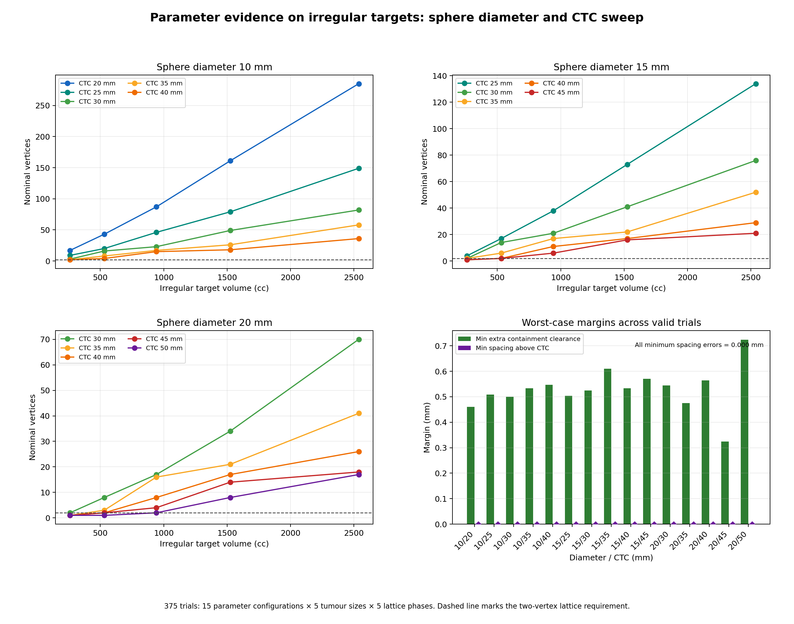

# Sphere-diameter and spacing evidence

## Scope

This sweep compiles the production geometry directly from `src/LatticeSphereGenerator.cs` and tests the following 15 configurations on the connected four-lobed irregular phantom:

- 10 mm diameter: 20, 25, 30, 35 and 40 mm CTC.
- 15 mm diameter: 25, 30, 35, 40 and 45 mm CTC.
- 20 mm diameter: 30, 35, 40, 45 and 50 mm CTC.

Each configuration was tested on five tumour volumes (261, 531, 942, 1525 and 2538 cc) and five lattice phases, giving 375 trials. Slice retry and end-slice filling were enabled on a simulated 2 mm slice grid.

Complete containment requires a ball with radius `sphere radius + 5 mm` to remain inside the original target. Candidate checks used 2,054 deterministic directions plus a 0.5 mm numerical guard. Independent checks used 8,198 directions at the required radius. The guard belongs only to this numerical phantom harness; production ESAPI uses segment-volume Boolean subtraction.

## Results

- 336 trials produced valid lattices of at least two vertices; every one passed spacing and independent containment checks.
- 39 trials produced fewer than two vertices and were classified as `NO_LATTICE` rather than retained as treatment lattices.
- No trial produced a geometric failure.
- Worst valid-trial centre-spacing error was 0.000000 mm within reported precision.
- Worst independent extra containment clearance was 0.324 mm.
- Maximum generated count was 292 vertices for 10 mm diameter / 20 mm CTC in the largest target and tested phases.

| Diameter (mm) | CTC (mm) | Nominal counts at increasing volumes | Valid phases | Worst extra clearance (mm) |
| ---: | ---: | --- | ---: | ---: |
| 10 | 20 | 17, 43, 87, 161, 285 | 25/25 | 0.461 |
| 10 | 25 | 9, 20, 46, 79, 149 | 25/25 | 0.508 |
| 10 | 30 | 3, 16, 23, 49, 82 | 25/25 | 0.499 |
| 10 | 35 | 2, 8, 17, 26, 58 | 24/25 | 0.533 |
| 10 | 40 | 2, 4, 15, 18, 36 | 24/25 | 0.547 |
| 15 | 25 | 4, 17, 38, 73, 134 | 25/25 | 0.504 |
| 15 | 30 | 2, 14, 21, 41, 76 | 24/25 | 0.524 |
| 15 | 35 | 2, 6, 17, 22, 52 | 23/25 | 0.610 |
| 15 | 40 | 1, 2, 11, 17, 29 | 21/25 | 0.534 |
| 15 | 45 | 1, 2, 6, 16, 21 | 20/25 | 0.570 |
| 20 | 30 | 2, 8, 17, 34, 70 | 23/25 | 0.545 |
| 20 | 35 | 1, 3, 16, 21, 41 | 21/25 | 0.475 |
| 20 | 40 | 1, 2, 8, 17, 26 | 21/25 | 0.564 |
| 20 | 45 | 1, 2, 4, 14, 18 | 19/25 | 0.324 |
| 20 | 50 | 1, 1, 2, 8, 17 | 16/25 | 0.724 |

The five count positions in each row correspond to 261, 531, 942, 1525 and 2538 cc. A count below two is intentionally rejected by the Eclipse adapter.



The core regression suite also reconstructs 10, 15 and 20 mm spheres with 96-point slice contours on 1, 2 and 3 mm slice spacing, using both on-slice and half-slice centre phases. All 18 diameter/spacing/phase cases remained within 5% of analytic sphere volume. This models plane integration and polygon approximation, not ESAPI voxel rasterization.

## Evidence and reproduction

- [All 375 results](../verification/parameter_sweep_summary.csv)
- [Run result](../verification/parameter_sweep_run.txt)
- [C# sweep driver](../verification/ParameterSweep.cs)
- [Figure generator](../verification/render_parameter_sweep.py)

```sh
dotnet run --project verification/ParameterSweep.csproj --configuration Release -- verification/parameter_sweep_summary.csv
python3 verification/render_parameter_sweep.py verification/parameter_sweep_summary.csv verification/parameter_sweep.png
```

These results verify parameter handling, lattice spacing and numerical containment outside Eclipse. They do not replace compilation against installed Varian assemblies or an Eclipse phantom study of realized segment volumes.
